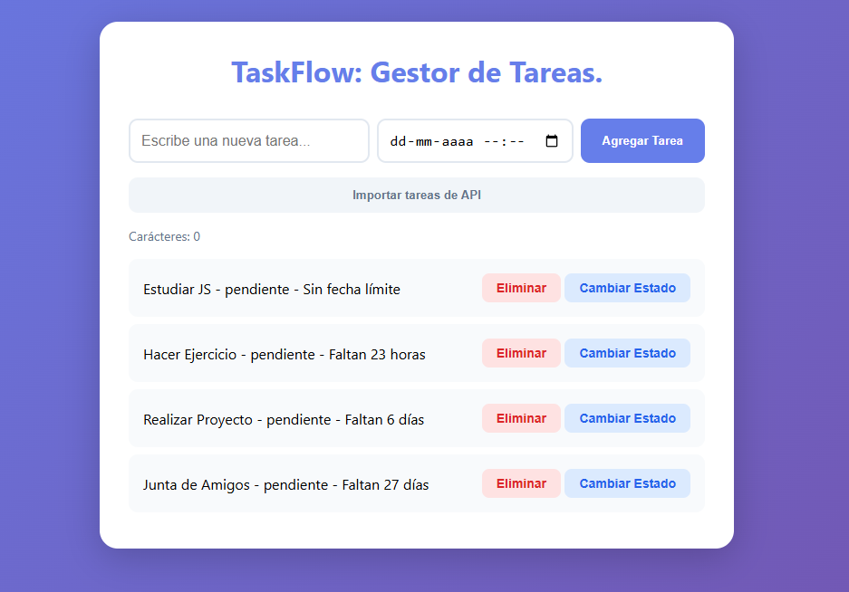

# 📋 TaskFlow - Gestor de Tareas

Aplicación web interactiva para gestionar tareas utilizando JavaScript moderno, desarrollada como proyecto del módulo de **Programación Avanzada en JavaScript**.

## 🌐 Demo en Vivo

[Ver aplicación](https://nicolasparadaa.github.io/m5-proyecto-abp/)

## 🎯 Objetivo del Proyecto

Desarrollar una aplicación funcional que permita gestionar tareas aplicando principios de programación orientada a objetos, manipulación del DOM, eventos, asincronía y consumo de APIs.

## ✅ Requisitos Implementados

### 1. Orientación a Objetos
- ✅ Clase `Tarea` con propiedades: id, descripción, estado, fecha de creación y fecha límite
- ✅ Clase `GestorTareas` para administrar la lista de tareas
- ✅ Métodos para agregar, eliminar y cambiar estado de tareas

### 2. JavaScript ES6
- ✅ `let` y `const` en lugar de `var`
- ✅ Template literals para strings dinámicos
- ✅ Arrow functions
- ✅ Destructuring y spread operator

### 3. Eventos y DOM
- ✅ Formulario HTML para agregar tareas
- ✅ Eventos `submit`, `click` y `keyup`
- ✅ Manipulación dinámica del DOM
- ✅ Contador de caracteres en tiempo real

### 4. JavaScript Asíncrono
- ✅ `setTimeout` para simular retardo en notificaciones
- ✅ `setInterval` para actualizar contador regresivo cada segundo
- ✅ Notificaciones con delays

### 5. Consumo de APIs
- ✅ Fetch a JSONPlaceholder API para importar tareas
- ✅ LocalStorage para persistencia de datos
- ✅ Manejo de errores con `try-catch`

## 🚀 Funcionalidades

- **Agregar tareas** con descripción y fecha límite opcional
- **Eliminar tareas** individualmente
- **Cambiar estado** entre "pendiente" y "completada"
- **Contador regresivo** que muestra tiempo restante (días, horas, minutos, segundos)
- **Importar tareas** desde API externa
- **Persistencia de datos** con LocalStorage
- **Notificaciones** al agregar tareas
- **Interfaz responsive** con diseño minimalista

## 🎨 Tecnologías Utilizadas

- **HTML5** - Estructura semántica
- **CSS3** - Estilos con metodología BEM
- **JavaScript ES6+** - Lógica de la aplicación
- **LocalStorage** - Almacenamiento local
- **Fetch API** - Consumo de datos externos
- **JSONPlaceholder** - API de prueba

## 📁 Estructura del Proyecto
´´´
taskflow/
├── index.html # Estructura HTML
├── style.css # Estilos con BEM
└── app.js # Lógica JavaScript
´´´

